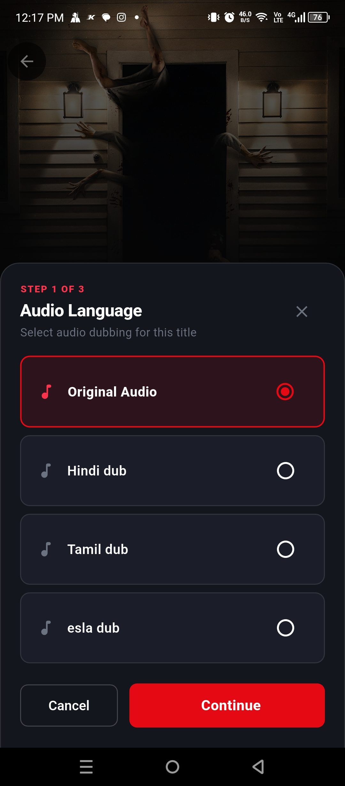
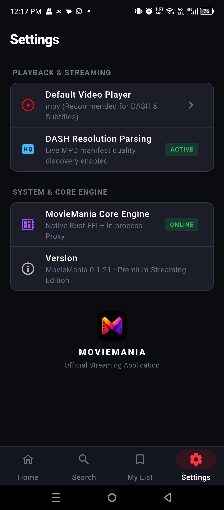
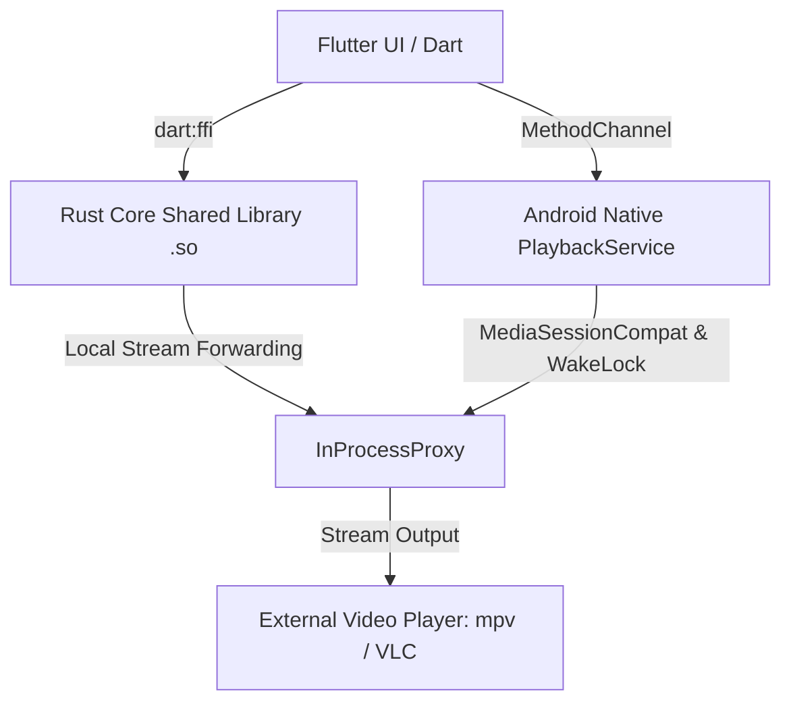

<div align="center">

  

  # MovieMania

  **A modern, cinematic streaming application built with Flutter, powered by a high-performance Rust core via Dart FFI.**

  <p>
    <a href="https://flutter.dev/"></a>
    <a href="https://dart.dev/"></a>
    <a href="https://www.rust-lang.org/"></a>
    <a href="https://developer.android.com/"></a>
    
    
  </p>

  <p>
    <a href="#-screenshots">Screenshots</a> •
    <a href="#-key-features">Key Features</a> •
    <a href="#-architecture">Architecture</a> •
    <a href="#-installation">Installation</a> •
    <a href="#-building-from-source">Build from Source</a> •
    <a href="#-credits--acknowledgments">Credits</a>
  </p>

</div>

---

## 📸 Screenshots

<div align="center">
  <table>
    <tr>
      <td width="25%" align="center">
        
        <br />
        <b>Home & Hero Section</b>
      </td>
      <td width="25%" align="center">
        
        <br />
        <b>Live Search Grid</b>
      </td>
      <td width="25%" align="center">
        
        <br />
        <b>Movie & Series Details</b>
      </td>
      <td width="25%" align="center">
        
        <br />
        <b>Watchlist & Library</b>
      </td>
    </tr>
    <tr>
      <td width="25%" align="center">
        
        <br />
        <b>Audio Language Selection</b>
      </td>
      <td width="25%" align="center">
        
        <br />
        <b>Subtitle Options</b>
      </td>
      <td width="25%" align="center">
        
        <br />
        <b>Dynamic Quality Discovery</b>
      </td>
      <td width="25%" align="center">
        
        <br />
        <b>Settings & Engine Status</b>
      </td>
    </tr>
  </table>
</div>

---

## ✨ Key Features

- 🎬 **Cinematic Flutter UI**: Dark mode streaming interface featuring hero carousels, responsive catalog rails, shimmer skeleton loaders, and fluid transitions.
- ⚡ **Rust Core via Dart FFI**: Integrates an existing Rust streaming engine compiled into native `.so` shared libraries for Android (`arm64-v8a` & `armeabi-v7a`), delivering fast metadata parsing with zero HTTP overhead.
- 🔊 **Multi-Language Audio & Subtitles**: Select available audio dubs and automatic subtitle tracks per release.
- 📊 **Dynamic DASH Resolution Parsing**: Discovers actual video stream resolutions (360p, 480p, 720p, 1080p, 4K) directly from live stream manifests.
- 🛡️ **Android Foreground Playback Service**: Kotlin `PlaybackService` leveraging `MediaSessionCompat` and partial `WakeLock` to stream reliably to external players (`mpv`, `VLC`) without background suspension.
- 📱 **Universal Standalone APK**: Self-contained release containing native binaries for both 64-bit and 32-bit Android devices without needing Termux or root.
- 🌐 **Chrome / Web Dev Bridge**: Includes a local HTTP bridge enabling rapid UI prototyping on desktop Chrome before physical hardware deployment.

---

## 🏗️ Architecture

MovieMania bridges a high-level Flutter frontend with a low-level Rust streaming engine:



### Component Breakdown

| Layer | Technology | Role |
| :--- | :--- | :--- |
| **Frontend** | Flutter / Dart | UI layout, state management, catalog presentation, search, details, and playback selection modal. |
| **Native Bridge** | `dart:ffi` | Direct in-memory C-ABI communication between Dart and Rust without local HTTP overhead on mobile. |
| **Core Engine** | Rust (`libmoviebox_core.so`) | Provider scraping, manifest decoding, DASH parsing, and streaming pipeline. |
| **Android Service** | Kotlin (`PlaybackService`) | Foreground service managing `MediaSessionCompat` and `WakeLock` to ensure stream continuity. |
| **Player Integration** | Intent / URI Forwarding | Delegated hardware-accelerated playback via external players (`mpv-android`, `VLC`). |

---

## 📥 Installation

### Android (APK)

1. Download the latest `app-release.apk` from the [Releases](https://github.com/Jari-Abbas-25/MovieMania/releases) section.
2. Install a compatible video player on your Android phone (Recommended: **[mpv for Android](https://play.google.com/store/apps/details?id=is.xyz.mpv)** or **[VLC](https://play.google.com/store/apps/details?id=org.videolan.vlc)**).
3. Install and launch **MovieMania**:
   ```bash
   adb install -r "app-release.apk"
   ```

---

## 🛠️ Building from Source

### Prerequisites

- [Flutter SDK](https://docs.flutter.dev/get-started/install) (`>= 3.10.0`)
- [Rust & Cargo](https://rustup.rs/) (`stable` toolchain)
- [Android NDK](https://developer.android.com/ndk) (for compiling Rust to Android ABI targets)
- [cargo-ndk](https://github.com/bbqsrc/cargo-ndk) (`cargo install cargo-ndk`)

### 1. Clone the Repository
```bash
git clone https://github.com/Jari-Abbas-25/MovieMania.git
cd MovieMania
```

### 2. Compile Rust Core for Android ABIs
```bash
# Build 64-bit and 32-bit Android native libraries
cargo ndk -t arm64-v8a -t armeabi-v7a -o ./android_app/android/app/src/main/jniLibs build --release
```

### 3. Build Android Release APK
```bash
cd android_app
flutter pub get
flutter build apk --release --target-platform android-arm64,android-arm
```
The compiled APK will be located at `android_app/build/app/outputs/flutter-apk/app-release.apk`.

---

## 💻 Web / Chrome Development Workflow

For rapid UI development, MovieMania includes a local bridge server:

1. **Start the Rust Dev Bridge:**
   ```bash
   cargo run --bin moviebox-tui -- --dev-bridge 8765
   ```

2. **Launch Flutter on Chrome:**
   ```bash
   cd android_app
   flutter run -d chrome
   ```

---

## 📂 Project Structure

```text
MovieMania/
├── android_app/                     # Flutter Application Root
│   ├── android/                     # Android native project & PlaybackService
│   │   └── app/src/main/jniLibs/    # Precompiled ARM64 & ARMv7 Rust .so libraries
│   ├── assets/                      # Application icons & logo assets
│   ├── lib/
│   │   ├── core/
│   │   │   ├── bridge/              # Dart FFI bindings & dev bridge client
│   │   │   ├── models/              # Media, season, and stream data models
│   │   │   └── player/              # Player launcher & platform intent handlers
│   │   ├── screens/                 # Home, Search, Details, and Settings screens
│   │   ├── theme/                   # Dark cinematic theme & color tokens
│   │   └── widgets/                 # Movie cards, hero banner, skeleton loaders
│   └── web/                         # Web platform assets & manifest
├── src/                             # Rust Core Engine & Providers
│   ├── bridge/                      # C-FFI exports & local dev bridge
│   ├── providers/                   # Scrapers, DASH manifest parsers & stream resolvers
│   └── proxy.rs                     # In-process proxy server for external players
├── images/                          # High-resolution screenshots & brand assets
├── .env.example                     # Environment template
└── Cargo.toml                       # Rust workspace definition
```

---

## 🤝 Credits & Acknowledgments

- **[moviebox-tui](https://github.com/mesamirh/MovieBox-Tui)**: Full credit and gratitude to the open-source `moviebox-tui` project for the foundational Rust streaming engine and scrapers.
- **Flutter & Rust Communities**: For providing exceptional tooling for cross-platform and FFI development.
- **AI-Assisted Workflow**: Built and integrated through an AI-assisted development workflow, pairing Flutter/Dart engineering with AI-driven cross-language exploration and debugging.

---

## 📜 License

This project is open-source software licensed under the **GNU General Public License v3.0 (GPL-3.0)**. See the [LICENSE](LICENSE) file for more details.

---

<div align="center">
  <sub>Built with ❤️ for cinema enthusiasts.</sub>
</div>
